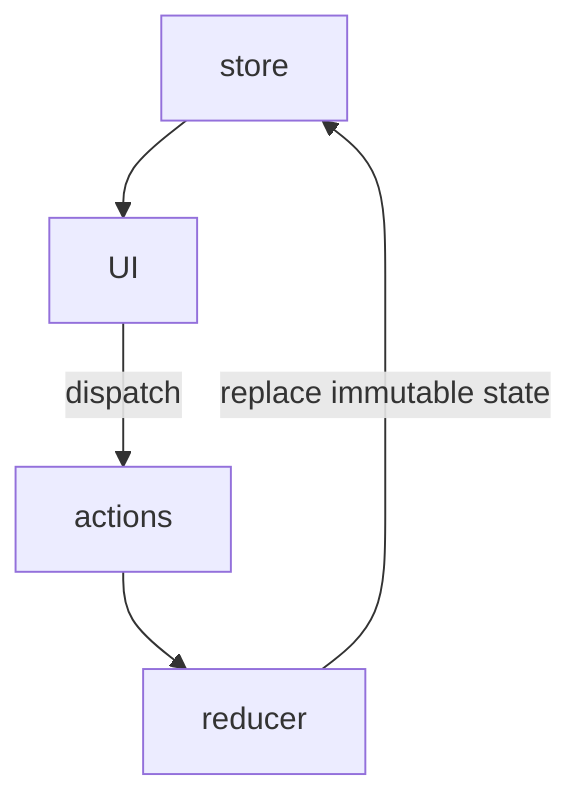

Read an article about [stop use redux](https://dev.to/g_abud/why-i-quit-redux-1knl) recently, it's a good article to read, however I don't agree with a bit from it.

The article basically says that Redux nowaydays are overkill of many web application, it's "cache" data in the frontend and make the SPA becomes more and more complicated.

## Is "Cache data" in front end a problem?

I belive it's not the case, and it's actually quite necessary to "cache data" in frontend.

It's quite easy to think about the scenario that the application is jumping from one page to another while just viewing things, you will never want the frontend pages to call backend api over and over.

In the situation that the real time consistency is not required, caching data can reduce calls to backend. Establish `http(s)` connection is expensive.

Another scenario is sharing data across pages, you can image there is page `A` displaying user infomation, page `B` is use user information to display a nice chart. Sure you can pass props to the `B` page component, but what if it's not child of `A`?

And usually some API response are work together and also seperate displaying in pages, this will create massive calls if all components are calling API just to get all data it self need and never share it.

## Is Redux too complicated?

I have experienced really complicated redux stores, reducers and massive actions. I'll say YES, those code sometimes do gets really complicated.

However, is redux by it self complicated? I don't believe so, it's just simple as following graph.

<!-- generated by mermaid compile action - START -->

  
Mermaid markup

<!-- generated by mermaid compile action - END -->

This is simple and predictable with immutable store and pure function reducer, and also great beneficial for unit testing it.

Those store, actions and reducers sometimes do become really giant and terrible, but that's not redux problem.

I notice the redux getting massive usually causing by team put EVERY single thing into it, but not all data should put into redux, with right data in store, you'll have much less actions too. Just think twice when want to put things into store.

The reducer implementation can be a bit annoying and boring, try [Redux toolkit](https://redux.js.org/redux-toolkit/overview) it's so helpful and it will be much easier to write redux with it.

## Conclusion

Redux is super useful and helpful, also the concept of one way data flow is simplify the application even more. The problem with complicated redux application, is not because of the redux it self, it's more about the way of using it.
