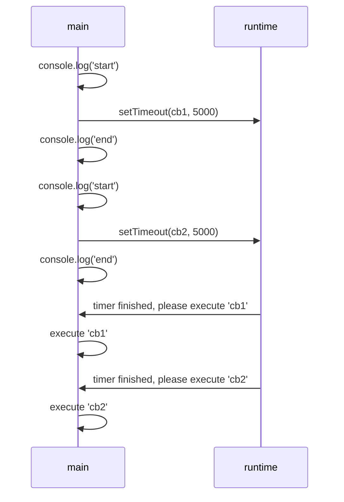

NodeJs is single thread, and also non-blocking, how it works? Let's create a `http` server work in NodeJs to understand this.

## Start a http server

With NodeJS, it's super easy to start a http server, just need to use `http` libary to cal `createServer` on it.

```js
const http = require('http');
const port = 3000;
http.createServer((request, response) => {}).listen(port);
```

The above code will start a service and listen on port: 3000.

The first parameter of `createServer` it's a callback function, which you can see every where in NodeJS. This pattern are widely used in other language as well known as a listener.

There are 2 things to highlight here:

1. It's a callback, which very comman in NodeJs

  Why a lot places in NodeJs are using this, and why it's recommanded to use? It's actually related to the `[event loop](https://en.wikipedia.org/wiki/Event_loop)` implementatino in NodeJs, and by this pattern, it make NodeJs application/service most efficient.

2. The parameter `request` and `response` are implemented from `Stream`

  This two parameters are implement from Stream, and Stream in NodeJs are also implemented from `EventEmiiter`, it's quite important because I understand this as the basic unit of NodeJs event driven system, how the `EventEmitter` looks like, check follow code block:

  ```js
  const EventEmitter = require('events');
  class DemoEmitter extends EventEmitter {}

  const demoEmitter = new DemoEmitter();
  demoEmitter.on('xing', () => {console.log('Event happened!')});
  demoEmitter.emit('xing');
  ```

  Yes, there's callback again.

## NodeJs application is single thread

As many of us know, NodeJs is single thread, so for each application process there are only *one* thread, more clearly example: When a single node NodeJs server started, all requests are in the same thread.

It's can easily proove if we put some crazy high time complixity in code. So I create following code:

```js
http.createServer((request, response) => {
  aLotCalculation();
}).listen(port);

const aLotCalculation = () => {
  let i = Number.MIN_SAFE_INTEGER;
  while (i < Number.MAX_SAFE_INTEGER) {
    i++;
  }
}
```

If we run the server, put a break point at line 2, and then call it with 2 times curl in different terminal. The break point will only hit once. This just to prove there are only 1 thread.

So how can this work without put all requests on hold when there are complicated logic in code? That's where NodeJs using Event loop to make it self non-blocking.

## Event loop

NodeJs running only 1 main thread, but It's not really only can do one thing a time, my understanding is because the [v8 engine](https://v8.dev/) runtime.

You can image like that: NodeJs main thread is like a pub/sub system, it will publish all the works can be done by the runtime, and subscribe the result and do something with the result.

*Event loop is how main thread can subscribe from the runtime about the works.*

So some code will be publish to the runtime to execute. Like `setTimeout`. Following are an example:

```js
http.createServer((request, response) => {
  console.log('start');
  setTimeout(() => {
      response.end("test");
      resolve();
    }, 5000
  )
  console.log('end');
}).listen(port);
```

This just simply response to the request after 5 secs, but if we call it twice, it will console log 'start' and 'end' immediately.

A sequence diagram will looks like following:



You can image that how runtime telling main thread to execute callback, is via the Event loop. So this allow us to run our NodeJs in the non-blocking way.

If we back to `http` server it self, remember we said that `request` and `response` are all extends from `Stream` and `Stream` extends from `EventEmitter`, that's how NodeJs publish those I/O tasks to runtime, and main thread will just wait for event loop to find out what's next to do.

## Async/Await

Base on the knowledge above, it's not hard to understand why NodeJs suggested to write code in the asynchronized way, which create many callback, and callback in callback...

You must heard of `async/await`, which can make the callback style code in a much more better way! Like this:

```js
http.createServer(async (request, response) => {
  console.log('start');
  await delyResponse(response, "boom"); // So much cleaner.
  console.log('end');
}).listen(port);

const delyResponse = (response, data) => new Promise(
  (resolve, reject) => {
    setTimeout(() => {
        response.end(data);
        resolve();
      }, 5000
    )
  }
)
```

This looks awesome, but will this break the rule that we should write things asynchronizly? We can try this, and on server we will get folloing result:

```sh
start
start
# 5 secs later
end
end
```

It tells us, that our http server still able to handle many requests and not blocking the main thread! This is just because we using `async/await` to write the code looks like sychronized way, but actually the runtime nativly run `async/await` in the asynchronized way like it's keyword telling us.

## Conclusion

NodeJs is single thread, but also non-blocking the main thread by run use `event loop` to pub/sub tasks to runtime. That's why we need to program NodeJs application/service in asynchronized style, and avoid to do some CPU bound tasks in main thread. We can end up with many callbacks in code, but we luckily now have `async/await` to help us reduce those callbacks and not break the async implementation.