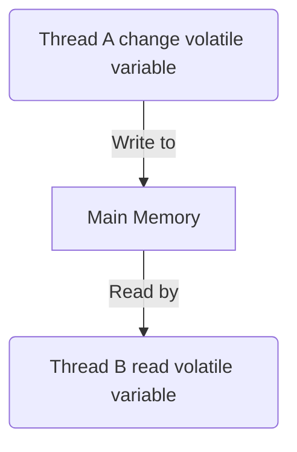

# Volatile

```java
public class Example {
  volatile boolean flag = true;
}
```

## Memory visibility

When use `volatile` keyword to declare variable, firstly you will get visibility of the variable cross different thread.

### Write & Read operation

The value will always write into main memory when write a volatile variable.

When read volatile variable also will always read from main memory.



## Reorder

Like mentioned in the [[happens-before]] rule, JVM like other computer process will reoder the command.

But for volatile it's a special case, the volatile will prevent reorder for it's own read and write. Which can make sure the read will happen after write.

And in some cases, it will prevent reorder with normal variables too:

1. When first operation is `volatile` read, it won't reorder with following operation.
2. When second operation is `volatile` write, it won't reorder with previous operation.
3. When first operation is `volatile` wirte, second operation is `volatile` read, won't get reordered.

### How JVM do this

JVM use [[JMM]] memory block insersion to implement this. There are 4 types of blocks:

- LoadLoad
- StoreStore
- LoadStore
- StoreLoad (most expensive one)

[//begin]: # "Autogenerated link references for markdown compatibility"
[happens-before]: happens-before "Happens before rule"
[JMM]: JMM "Java memory model"
[//end]: # "Autogenerated link references"